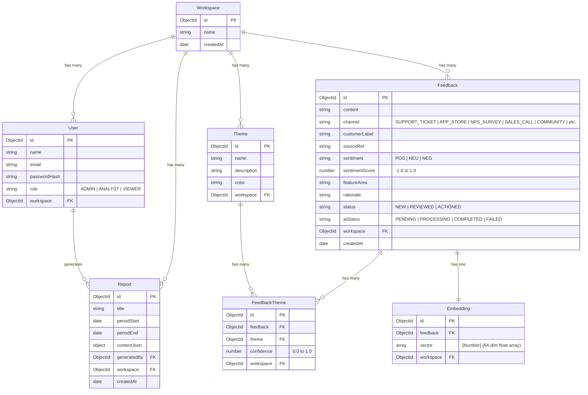

# 🔄 Project LOOP — AI Customer-Feedback Intelligence Platform

> **Zidio Development Internship Capstone Project Brief & Specification**  
> **Repository:** [https://github.com/madhan023-mn/ai-customer-feedback.git](https://github.com/madhan023-mn/ai-customer-feedback.git)  
> **Product Slogan:** *"Close the loop on customer feedback."*  
> **Stack:** MERN Stack (MongoDB, Express.js, React 18 + Vite, Node.js) + Vector Embeddings + RAG Grounding + PDFKit + Recharts

---

## 🌟 01 Project Overview & Business Problem

Every product company is drowning in customer feedback arriving from support tickets, app store reviews, NPS/CSAT surveys, sales notes, and community channels.

**Project LOOP** transforms scattered feedback into a ranked, evidence-backed list of what to build, fix, and improve next:
- Ingests feedback from multiple channels (single entry, universal CSV importer, simulated channel feeds).
- Uses AI to classify sentiment (`POS`, `NEU`, `NEG`), calculate sentiment scores ($-1.0 \dots 1.0$), map feature areas, and extract themes with confidence scores.
- Clusters feedback into named themes, tracking volume trends and period-over-period spike detection (+68% alert threshold).
- **Ask LOOP (Retrieval-Augmented Generation / RAG)**: Plain-English semantic vector search grounded strictly in retrieved feedback with source citations.
- **Voice-of-Customer (VoC) Reports**: Generates automated executive digests with pre-computed metrics, notable verbatim quotes, and recommended product actions, exportable as downloadable PDFs.

---

## 🏢 02 System Architecture

```
                      ┌────────────────────────────────────────┐
                      │          React 18 + Vite Client        │
                      │  (Dashboard, Inbox, Themes, Ask, VoC)  │
                      └───────────────────┬────────────────────┘
                                          │ (REST API + JWT)
                                          ▼
                      ┌────────────────────────────────────────┐
                      │        Node.js / Express API Layer     │
                      │  (Auth, RBAC Guards, Tenant Isolation) │
                      └───────┬───────────┬────────────┬───────┘
                              │           │            │
             ┌────────────────┘           │            └────────────────┐
             ▼                            ▼                             ▼
   ┌───────────────────┐        ┌───────────────────┐        ┌─────────────────────┐
   │     MongoDB       │        │  Redis + BullMQ   │        │  AI Services & RAG  │
   │  (Multi-Tenant    │        │  (Async Queue &   │        │ (Claude/Gemini/OAI  │
   │  Collections &    │        │  Fault-Tolerant   │        │  Dense Embeddings & │
   │  Vector Storage)  │        │  Sync Fallback)   │        │  Grounded Answers)  │
   └───────────────────┘        └───────────────────┘        └─────────────────────┘
```

### 🔒 Non-Negotiable Security & Multi-Tenant Isolation
Every query touching `Feedback`, `Theme`, `FeedbackTheme`, `Embedding`, `Report`, or `User` is filtered by the caller's authenticated `workspaceId` (`req.user.workspace`). Cross-tenant access is strictly blocked at the API layer.

---

## 🔐 03 Demo Login Credentials (RBAC)

Graders and mentors can evaluate all three roles using the pre-seeded demo workspace (**Acme Corp**):

| Role | Email | Password | Permissions & Capabilities |
| :--- | :--- | :--- | :--- |
| **ADMIN** | `admin@acme.com` | `password123` | Full access: Feedback CRUD, CSV Bulk Import, User & Role Management, VoC Reports |
| **ANALYST** | `analyst@acme.com` | `password123` | Ingest feedback, trigger AI classification, explore Themes & Trends, Ask LOOP RAG, generate VoC reports |
| **VIEWER** | `viewer@acme.com` | `password123` | Read-only access to Analytics Dashboard, Feedback Inbox, Theme Explorer, and Reports |

---

## 📊 04 Data Model & Entity Relationships



---

## 🚀 05 Feature Checklist (Zidio Rubric Mapping)

### 📌 Core Features (C1–C5)
- [x] **C1: Authentication & Workspaces**: Sign-up creates User and Workspace (creator = `ADMIN`); bcrypt password hashing; JWT session persistence; protected routes.
- [x] **C2: Role-Based Access Control**: Server-side 403 enforcement for `ADMIN`, `ANALYST`, and `VIEWER` on mutations.
- [x] **C3: Feedback Ingestion**: Single manual entry form, universal CSV bulk importer with error reporting, and 5 simulated channel integration buttons.
- [x] **C4: Feedback Inbox**: Server-side pagination, full-text search, date-range picker (`fromDate` / `toDate`), multi-param filters (channel, sentiment, theme, status), inline status workflow (`NEW` $\rightarrow$ `REVIEWED` $\rightarrow$ `ACTIONED`), and saved view quick presets.
- [x] **C5: Analytics Dashboard**: 3+ Recharts visual charts (Volume Over Time Area Chart, Sentiment Breakdown Donut Chart, Top Themes Ranking Bar Chart, Channel Distribution Chart), stat KPI cards, and negativity spike alert banner.

### 🤖 AI Intelligence Features (AI1–AI4)
- [x] **AI1: Auto-Classification**: Structured output (sentiment, sentiment score $-1..1$, themes with confidence scores $0..1$, feature-area label, one-line rationale). Stored on the record; includes manual re-classify action.
- [x] **AI2: Theme Clustering & Trends**: Dynamic theme grouping, period-over-period volume comparisons, spike detection alerts (+68% threshold flag 🔥), and interactive drill-down into underlying feedback.
- [x] **AI3: Ask LOOP (Retrieval-Augmented Generation / RAG)**: Plain-English semantic vector Q&A using Cosine Similarity over `Embedding` vectors; answers grounded strictly in retrieved context with cited feedback source cards.
- [x] **AI4: Voice-of-Customer (VoC) Reports**: One-click weekly/monthly executive digest generator; pre-computes statistics in code to prevent hallucination; produces executive narrative with verbatim customer quotes and recommended actions; saves to MongoDB and exports downloadable PDFs.

### 🎯 Stretch Goals
- [x] **Saved Views / Segment Presets**: Quick inbox filters (*All Feedback, Negative Complaints, Payment Blockers, Mobile Experience, Positive Praise, Untriaged*).
- [x] **Sentiment Trend Alerts**: Prominent dashboard banner when negative feedback exceeds threshold.
- [x] **Offline Redis Fault Tolerance**: Automatic synchronous fallback processing if Redis queue is offline.

---

## 💻 06 Installation & Local Setup

### Prerequisites
- Node.js 18 LTS or newer
- MongoDB running locally (`mongodb://127.0.0.1:27017/loop_db`) or MongoDB Atlas URI
- Git

### 1. Clone & Configure
```bash
git clone https://github.com/madhan023-mn/ai-customer-feedback.git
cd ai-customer-feedback/LOOP-MERN
```

### 2. Configure Environment Variables

**`server/.env`**:
```env
PORT=5000
MONGO_URI=mongodb://127.0.0.1:27017/loop_db
JWT_SECRET=loop_jwt_secret_key_2026_zidio
REDIS_HOST=127.0.0.1
REDIS_PORT=6379

# AI Provider API Keys (Optional - Heuristic & local vector fallback engine activates if omitted)
GEMINI_API_KEY=your_gemini_api_key
OPENAI_API_KEY=your_openai_api_key
```

**`client/.env`**:
```env
VITE_API_URL=http://localhost:5000/api
```

### 3. Install Dependencies
```bash
# Install server dependencies
cd server
npm install

# Install client dependencies
cd ../client
npm install
```

### 4. Seed the Database
Populates MongoDB with 1 demo workspace, 3 demo users (`ADMIN`, `ANALYST`, `VIEWER`), 10 explicit `Theme` entities, 125 `Feedback` records, 125 `FeedbackTheme` join rows with confidence scores, and 125 `Embedding` dense vectors:
```bash
cd server
node seed.js
```

### 5. Run Application
```bash
# Terminal 1: Run Backend Server
cd server
npm run dev

# Terminal 2: Run Frontend Client
cd client
npm run dev
```

Open [http://localhost:5173](http://localhost:5173) in your browser and log in using `admin@acme.com` / `password123`.

---

## 📡 07 Key API Endpoints

| Method | Endpoint | Description | Role Required |
| :--- | :--- | :--- | :--- |
| `POST` | `/api/auth/register` | Sign up user and create isolated workspace | Public |
| `POST` | `/api/auth/login` | Log in and receive JWT token | Public |
| `GET` | `/api/feedback` | Paginated feedback inbox with search and filters | Any authenticated |
| `POST` | `/api/feedback` | Create single feedback item | Admin, Analyst |
| `POST` | `/api/import/feedback` | Bulk import feedback from CSV | Admin, Analyst |
| `POST` | `/api/feedback/simulate` | Ingest simulated channel feedback | Admin, Analyst |
| `POST` | `/api/feedback/:id/analyze`| Trigger AI classification for item | Admin, Analyst |
| `GET` | `/api/themes` | List themes with feedback counts & confidence | Any authenticated |
| `GET` | `/api/themes/trends` | Period-over-period theme volume & spike alerts | Any authenticated |
| `POST` | `/api/ai/ask` | Vector-grounded semantic Ask LOOP Q&A | Any authenticated |
| `POST` | `/api/reports/voc` | Generate Voice-of-Customer report | Admin, Analyst |
| `GET` | `/api/reports/export/pdf/:id` | Export VoC report as formatted PDF | Admin, Analyst |
| `GET` | `/api/members` | List workspace members | Admin |
| `POST` | `/api/members/invite` | Invite new user to workspace | Admin |

---

## 📄 08 License & Attribution
Issued by **Zidio Development** — Web Development Track Capstone Project.  
Built with corporate-grade software standards.
