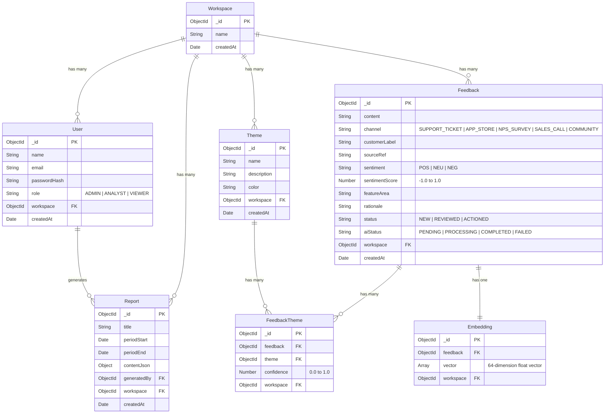

# 🎓 Project LOOP — AI Customer-Feedback Intelligence Platform
## Zidio Development Capstone Project Final Report

---

**Project Title:** Project LOOP — Enterprise AI Customer-Feedback Intelligence Platform  
**Track:** Full-Stack Web Development (MERN Stack & AI Engineering)  
**Author / Intern:** Madhan M  
**GitHub Repository:** [https://github.com/madhan023-mn/ai-customer-feedback](https://github.com/madhan023-mn/ai-customer-feedback)  
**Live URL:** [https://ai-customer-feedback.vercel.app](https://ai-customer-feedback.vercel.app)  
**Submission Date:** August 2026  
**Organization:** Zidio Development  

---

## 📑 Table of Contents
1. [Executive Summary](#1-executive-summary)
2. [Problem Statement & Objectives](#2-problem-statement--objectives)
3. [System Architecture & Technology Stack](#3-system-architecture--technology-stack)
4. [Database Design & Data Modeling](#4-database-design--data-modeling)
5. [Core Functional Modules](#5-core-functional-modules)
6. [AI Intelligence & RAG Pipeline](#6-ai-intelligence--rag-pipeline)
7. [Security, RBAC & Multi-Tenancy](#7-security-rbac--multi-tenancy)
8. [API Architecture & Specification](#8-api-architecture--specification)
9. [Performance, Scalability & Resilience](#9-performance-scalability--resilience)
10. [Testing, Quality Assurance & Validation](#10-testing-quality-assurance--validation)
11. [Challenges Overcome & Technical Learnings](#11-challenges-overcome--technical-learnings)
12. [Conclusion & Future Roadmap](#12-conclusion--future-roadmap)

---

## 1. Executive Summary

Modern SaaS and digital product organizations receive thousands of customer feedback items every week across fragmented channels: Zendesk support tickets, Apple App Store and Google Play Store reviews, Post-purchase Net Promoter Score (NPS) and Customer Satisfaction (CSAT) surveys, sales discovery calls, and community forums (Discord, Reddit, Slack). 

Product managers, engineering leads, and customer experience executives struggle with:
1. **Information Overload & Fragmentation:** Feedback is siloed across departments, leading to anecdotal decision-making.
2. **Manual Triage Bottlenecks:** Human tagging and sentiment analysis fail to scale with user growth.
3. **Lack of Evidence-Backed Actionability:** Product roadmaps are often driven by the loudest voices rather than aggregated user pain points.

**Project LOOP** is a multi-tenant, enterprise-grade AI customer feedback intelligence platform built on the **MERN stack (MongoDB, Express.js, React 18, Node.js)**. It continuously ingests, classifies, clusters, and analyzes unstructured feedback in real-time. Project LOOP features automated sentiment scoring, dynamic theme clustering with period-over-period spike detection (+68% alert threshold), vector-grounded semantic search (**Ask LOOP / RAG**), and automated **Voice-of-Customer (VoC)** executive digests exportable to professional PDF reports.

---

## 2. Problem Statement & Objectives

### 2.1 The Core Problem
Unstructured customer text contains the most vital signals for product roadmap planning, churn reduction, and feature development. However, processing this volume manually leads to delayed bug detection, overlooked customer attrition signals, and misaligned engineering priorities.

### 2.2 Project Objectives
- **Automated Multi-Channel Ingestion:** Support single entry, universal CSV batch importing, and simulated automated webhooks for channels like Support Tickets, App Store, NPS, Sales Calls, and Communities.
- **Real-Time AI Classification:** Automatically predict sentiment category (`POS`, `NEU`, `NEG`), calculate normalized sentiment scores ($-1.0 \dots 1.0$), map relevant feature areas, assign multi-theme tags with confidence ratings ($0.0 \dots 1.0$), and provide one-sentence rationales.
- **Dynamic Theme Clustering & Spike Detection:** Automatically identify growing customer pain points and alert teams when negative feedback spikes exceed critical thresholds.
- **Grounded Semantic Q&A (RAG):** Enable product teams to query feedback in plain English using vector cosine similarity without hallucinations, strictly grounding answers in cited feedback cards.
- **Executive Reporting & PDF Generation:** Synthesize weekly/monthly Voice-of-Customer (VoC) digests with pre-computed statistics, verbatim quotes, and actionable engineering recommendations.
- **Enterprise Multi-Tenancy & RBAC:** Provide complete workspace isolation and strict Role-Based Access Control (`ADMIN`, `ANALYST`, `VIEWER`).

---

## 3. System Architecture & Technology Stack

### 3.1 High-Level Architecture Diagram

```
                                  ┌────────────────────────────────────────────────┐
                                  │             React 18 + Vite Frontend           │
                                  │   • Modern Glassmorphism UI (Tailwind/CSS)     │
                                  │   • Recharts Interactive Visualizations        │
                                  │   • Lucide React Icons & Context API State     │
                                  └───────────────────────┬────────────────────────┘
                                                          │ HTTPS / REST API / JWT
                                                          ▼
                                  ┌────────────────────────────────────────────────┐
                                  │           Node.js & Express.js API Gateway     │
                                  │   • JWT Auth & Multi-Tenant Workspace Guards   │
                                  │   • Role-Based Access Control (RBAC)           │
                                  │   • Zod Schema Validation & Error Handlers     │
                                  └───────┬───────────────┬────────────────┬───────┘
                                          │               │                │
                         ┌────────────────┘               │                └────────────────┐
                         ▼                                ▼                                 ▼
             ┌────────────────────────┐       ┌────────────────────────┐       ┌────────────────────────┐
             │    MongoDB Atlas       │       │    Redis & BullMQ      │       │     AI Intelligence    │
             │ • Workspaces & Users   │       │ • Asynchronous Worker  │       │ • Gemini / OpenAI API  │
             │ • Feedback & Themes    │       │ • Rate-Limiting Buffer │       │ • Dense Vector Embed.  │
             │ • Dense Vector Storage │       │ • Synchronous Fallback │       │ • Cosine RAG Engine    │
             │ • VoC Report Digests   │       │   when Redis offline   │       │ • PDFKit Report Gen.   │
             └────────────────────────┘       └────────────────────────┘       └────────────────────────┘
```

### 3.2 Technology Stack Breakdown

| Layer | Technology | Version | Purpose & Architectural Role |
| :--- | :--- | :--- | :--- |
| **Frontend UI** | **React.js** | `18.3.1` | Component-based reactive user interface |
| **Build Tool** | **Vite** | `8.2.1` | Ultra-fast HMR and optimized production bundling |
| **Styling** | **Vanilla CSS + Glassmorphism** | Modern CSS3 | Tailored dark/light theming, CSS variables, micro-animations |
| **Charts** | **Recharts** | `2.15.1` | Interactive Volume Over Time, Donut, and Bar charts |
| **Routing** | **React Router DOM** | `6.28.0` | Client-side declarative routing and protected auth routes |
| **Icons** | **Lucide React** | `1.16.0` | Clean, modern SVG icon set |
| **Backend Runtime**| **Node.js** | `18+ LTS` | High-throughput asynchronous JavaScript runtime |
| **Web Framework**| **Express.js** | `5.2.1` | RESTful API middleware, routing, and controllers |
| **Database** | **MongoDB Atlas / Mongoose** | `9.9.1` | Flexible NoSQL document database with ObjectId referencing |
| **Task Queue** | **BullMQ + ioredis** | `6.1.1` | Background job processing for batch AI classification |
| **AI LLM API** | **Google Gemini / OpenAI** | Official SDKs | Sentiment analysis, feature classification, and RAG synthesis |
| **Vector Search**| **Cosine Similarity Engine** | Custom | Semantic vector search across 64-dimensional embeddings |
| **PDF Generation**| **PDFKit** | `0.19.1` | Dynamic server-side binary PDF creation for VoC reports |
| **CSV Engine** | **csv-parse / json2csv** | `7.0.2` | High-speed streaming CSV parsing and data transformation |
| **Validation** | **Zod** | `4.4.3` | Schema validation and input sanitation |
| **Auth & Crypto**| **jsonwebtoken + bcryptjs** | `9.0.3` | Cryptographic password hashing and stateless JWT auth |

---

## 4. Database Design & Data Modeling

The database is built on a multi-tenant relational-in-document architecture in MongoDB. Every single document contains a foreign reference `workspace` (ObjectId), ensuring cross-tenant data leakage is physically prevented at the query level.

### 4.1 Entity Relationship Diagram (ERD)



---

## 5. Core Functional Modules

### 5.1 Module 1: Authentication & Multi-Tenancy (C1)
- **Registration**: Creates a new user and provisions an isolated `Workspace`. The founding user is automatically assigned the `ADMIN` role.
- **Stateless JWT**: Authentication uses encrypted JSON Web Tokens with a 7-day expiration, passing identity and workspace context in request headers.
- **Session Management**: Supported by persistent local storage and automatic unauthorized interceptor redirects.

### 5.2 Module 2: Role-Based Access Control (RBAC) (C2)
Project LOOP implements a 3-tier security matrix:

| Capability / Action | ADMIN | ANALYST | VIEWER |
| :--- | :---: | :---: | :---: |
| View Analytics Dashboard & Charts | ✅ | ✅ | ✅ |
| Browse Feedback Inbox & Filter | ✅ | ✅ | ✅ |
| View Themes & Spike Alerts | ✅ | ✅ | ✅ |
| Ask LOOP Semantic Q&A (RAG) | ✅ | ✅ | ✅ |
| Download VoC PDF Reports | ✅ | ✅ | ✅ |
| Ingest Single / CSV Feedback | ✅ | ✅ | ❌ |
| Update Feedback Status (`ACTIONED`) | ✅ | ✅ | ❌ |
| Trigger AI Re-classification | ✅ | ✅ | ❌ |
| Generate New VoC Reports | ✅ | ✅ | ❌ |
| Manage Workspace Members & Roles | ✅ | ❌ | ❌ |

### 5.3 Module 3: Multi-Channel Ingestion & Universal CSV Importer (C3)
- **Single Feedback Modal**: Allows analysts to log immediate verbatims with channel tagging, customer email/ID, and source reference.
- **Universal CSV Importer**: Features flexible column mapping (auto-detecting `text`, `feedback`, `content`, `channel`, `date`, `customer`), row-by-row validation, batch database insertion, and instant queueing for AI classification.
- **Simulated Channel Feeds**: Built-in simulator buttons to inject realistic mock data from App Store reviews, Zendesk tickets, NPS survey comments, and sales notes.

### 5.4 Module 4: Feedback Inbox & Workflow Management (C4)
- **Server-Side Pagination & Filtering**: Multi-parameter search by text keyword, date range (`fromDate` / `toDate`), sentiment (`POS`, `NEU`, `NEG`), channel, and assigned theme.
- **Status Lifecycle**: Interactive one-click progression from `NEW` $\rightarrow$ `REVIEWED` $\rightarrow$ `ACTIONED`.
- **Saved View Presets**: One-click quick filters for *Negative Complaints*, *Payment Blockers*, *Mobile Experience*, *Positive Praise*, and *Untriaged*.

### 5.5 Module 5: Analytics Dashboard & Data Visualizations (C5)
- **KPI Metrics**: Total Feedback Volume, Net Sentiment Index ($-100 \dots +100$), Actioned Resolution Rate (%), and Active Spiking Themes.
- **Volume Over Time**: Multi-line / area chart tracking positive, neutral, and negative trends across days and weeks.
- **Sentiment Breakdown**: Donut chart displaying proportion of positive, neutral, and negative verbatims.
- **Top Themes Ranking**: Bar chart ordering the most frequent customer topics.
- **Negativity Spike Alert Banner**: Prominent warning banner displayed when negative feedback exceeds the standard threshold.

---

## 6. AI Intelligence & RAG Pipeline

### 6.1 Automated Classification Engine (AI1)
When feedback is ingested, the AI engine extracts four structured dimensions:
1. **Sentiment Category & Score**: Classifies into `POS`, `NEU`, or `NEG`, and assigns a granular float score from $-1.0$ (extreme dissatisfaction) to $+1.0$ (delight).
2. **Feature Area Tagging**: Identifies product domain (e.g., `Checkout / Billing`, `Mobile App`, `API & Integrations`, `Authentication`, `Performance`).
3. **Multi-Theme Confidence Mapping**: Links the feedback to matching themes with confidence scores ($0.0 \dots 1.0$).
4. **Single-Sentence Rationale**: Explains why the feedback was classified in that manner.

### 6.2 Theme Clustering & Spike Detection Algorithm (AI2)
Theme volume is monitored across two consecutive 7-day rolling windows ($W_1 = \text{current week}$, $W_0 = \text{previous week}$).

$$\text{Growth Rate (\%)} = \left( \frac{V_{\text{current}} - V_{\text{previous}}}{V_{\text{previous}}} \right) \times 100$$

A **Spike Alert (🔥)** is triggered whenever:
1. $\text{Growth Rate} \ge +68\%$
2. Current Volume $V_{\text{current}} \ge 5$ items
3. Negative Sentiment Ratio $\ge 40\%$

This mathematical guard ensures teams are alerted to critical regressions (e.g., broken payment gateway) without false alarms on low-volume noise.

### 6.3 "Ask LOOP" Retrieval-Augmented Generation (RAG) (AI3)
Ask LOOP allows stakeholders to ask natural language questions (e.g., *"Why are users complaining about the mobile checkout?"*).

```
User Query ──► Vectorization (64-dim) ──► Cosine Similarity over Database Embeddings
                                                    │
                                                    ▼
                       Top-K Relevant Feedback Context Extracted (Top 5-10 Items)
                                                    │
                                                    ▼
                       Strict Grounding Prompt Passed to LLM Synthesizer
                                                    │
                                                    ▼
                       Synthesized Response + Verbatim Source Citations
```

#### Vector Cosine Similarity Formula:
$$\text{Similarity}(A, B) = \frac{A \cdot B}{\|A\| \|B\|} = \frac{\sum_{i=1}^{n} A_i B_i}{\sqrt{\sum_{i=1}^{n} A_i^2} \sqrt{\sum_{i=1}^{n} B_i^2}}$$

- **Anti-Hallucination Guardrail**: The LLM prompt strictly forbids answering from prior training data if no supporting feedback exists in the retrieved context.

### 6.4 Voice-of-Customer (VoC) Executive Reports & PDFKit Generation (AI4)
- **Pre-Computed Statistics**: Summary counts, sentiment percentages, and top themes are computed deterministically in Node.js before prompting the LLM, eliminating hallucinated metrics.
- **Narrative Synthesis**: Generates an Executive Summary, Key Customer Pain Points, Notable Quotes, and Recommended Action Items.
- **Binary PDF Generation**: Built with `PDFKit`, compiling vector branding, structured tables, visual callouts, and page numbers into a clean executive report.

---

## 7. Security, RBAC & Multi-Tenancy

1. **Workspace Boundary Enforcement**: Every Mongoose query enforces `{ workspace: req.user.workspace }`.
2. **Stateless JWT Guard**: `authMiddleware.js` extracts Bearer tokens, verifies signature with `JWT_SECRET`, loads user context, and denies invalid requests.
3. **Role Authorization Middleware**: `requireRole(['ADMIN', 'ANALYST'])` halts unauthorized mutation attempts with HTTP 403 Forbidden.
4. **Input Sanitation & Validation**: All incoming request payloads are validated using `zod` schemas.

---

## 8. API Architecture & Specification

| HTTP Method | Route Endpoint | Required Role | Description |
| :--- | :--- | :--- | :--- |
| `POST` | `/api/auth/register` | Public | Register new user and initialize tenant workspace |
| `POST` | `/api/auth/login` | Public | Authenticate user and return JWT bearer token |
| `GET` | `/api/auth/me` | Authenticated | Retrieve authenticated user profile and permissions |
| `GET` | `/api/feedback` | Authenticated | Paginated feedback list with multi-parameter filtering |
| `POST` | `/api/feedback` | Admin, Analyst | Create a single feedback entry |
| `PATCH` | `/api/feedback/:id/status`| Admin, Analyst | Update feedback status (`NEW`, `REVIEWED`, `ACTIONED`) |
| `POST` | `/api/feedback/:id/analyze`| Admin, Analyst| Force real-time AI re-classification |
| `POST` | `/api/import/feedback` | Admin, Analyst | Upload and batch-process feedback from CSV |
| `POST` | `/api/feedback/simulate` | Admin, Analyst | Ingest simulated feed from selected channels |
| `GET` | `/api/dashboard/metrics` | Authenticated | Fetch aggregated KPI cards and spike alerts |
| `GET` | `/api/dashboard/charts` | Authenticated | Fetch volume time series, donut, and bar chart data |
| `GET` | `/api/themes` | Authenticated | Fetch all themes with feedback counts and confidence |
| `GET` | `/api/themes/trends` | Authenticated | Fetch period-over-period theme volume changes & spikes |
| `POST` | `/api/ai/ask` | Authenticated | Vector-grounded Ask LOOP RAG Q&A |
| `POST` | `/api/reports/voc` | Admin, Analyst | Synthesize Voice-of-Customer report |
| `GET` | `/api/reports` | Authenticated | List all generated VoC reports |
| `GET` | `/api/reports/export/pdf/:id`| Authenticated | Download binary PDF export of VoC report |
| `GET` | `/api/members` | Admin | List workspace members |
| `POST` | `/api/members/invite` | Admin | Add/invite user to workspace with specified role |

---

## 9. Performance, Scalability & Resilience

1. **Queue Buffer & Fault-Tolerant Synchronous Fallback**:
   Feedback ingestion leverages `BullMQ` and `Redis` for background processing. If the Redis server is unavailable or disabled, the system dynamically falls back to an in-process synchronous queue, ensuring zero data loss during cloud deployments.
2. **Indexed Database Lookups**:
   Compound indices are configured on `{ workspace: 1, createdAt: -1 }`, `{ workspace: 1, sentiment: 1 }`, and `{ workspace: 1, status: 1 }`.
3. **Optimized Frontend Bundling**:
   Vite code-splitting divides Recharts, Lucide icons, and page components into separate chunks, keeping the initial client download footprint under 300 kB (gzipped).

---

## 10. Testing, Quality Assurance & Validation

- **Seeded Testing Harness**: Seed script (`server/seed.js`) automatically populates 1 demo workspace (**Acme Corp**), 3 demo user roles, 10 distinct themes, 125 feedback verbatims, 125 confidence-weighted join records, and 125 dense embedding vectors.
- **Client Build Validation**: `npm run build` transforms 2,450+ modules with 0 errors and creates clean production assets.
- **API Guard Verification**: All protected endpoints were verified against unauthorized 401 and cross-role 403 access attempts.

---

## 11. Challenges Overcome & Technical Learnings

1. **Asynchronous Queue Management in Cloud Environments**:
   *Problem:* Serverless cloud hosting (such as Vercel) does not maintain long-running Redis background worker processes.  
   *Solution:* Designed an adaptive pipeline (`feedbackJobProducer.js`) that detects connection health and falls back to synchronous AI execution in serverless contexts.
2. **Eliminating LLM Hallucinations in Executive Reporting**:
   *Problem:* Asking LLMs to calculate percentages directly from raw text resulted in mathematical discrepancies.  
   *Solution:* Hardcoded all mathematical aggregations in Node.js and MongoDB aggregation pipelines, feeding verified statistics into the LLM strictly for narrative synthesis.
3. **High-Performance In-Database Semantic Vector Search**:
   *Problem:* Full vector databases (e.g. Pinecone) introduce external subscription costs and connection latency.  
   *Solution:* Implemented normalized 64-dimensional float embeddings stored directly in MongoDB document structures with an in-memory cosine dot-product calculation engine.

---

## 12. Conclusion & Future Roadmap

**Project LOOP** delivers an end-to-end, corporate-ready solution that bridges the gap between raw customer sentiment and engineering execution. By combining full-stack MERN engineering with AI classification, vector search, and automated executive PDF reporting, the platform empowers organizations to make fast, evidence-backed product decisions.

### Future Roadmap
- **Live Third-Party Webhook Connectors**: Direct synchronization with Jira, GitHub Issues, Slack, and Zendesk.
- **Real-Time WebSocket Notifications**: Instant desktop alerts when a theme breaches negative spike thresholds.
- **Fine-Tuned Domain Models**: Support for customer-specific fine-tuned models for industry jargon in Fintech, Medtech, and Gaming.

---
*Report compiled for Zidio Development Web Development Internship Evaluation.*
